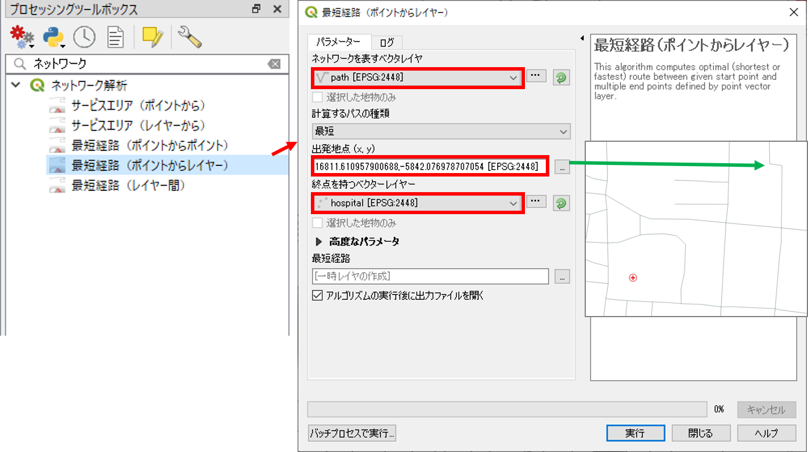

# ネットワーク分析
　本教材は、「ネットワーク分析」の実習用教材です。GISソフトウェアを用いた、最短経路検索や到達圏検索の手法について解説したものです。

**Menu**
------
* [最短距離検索](#最短距離検索)

以下に関心がある方は、GIS実習オープン教材を参照してください。
* [ネットの分割](#ネットの分割)
* [到達圏分析](#到達圏分析)
* [巡回セールスマン問題](#巡回セールスマン問題)
* [サブネット設定](#サブネット設定)

**実習用データ**

実習をはじめる前に、[network]をダウンロードしてください。

[network]:https://github.com/gis-oer/datasets/raw/master/network.zip

## 最短距離検索
　QGISで、2点間の最短距離を求める手法について解説します。この実習をはじめる前に`hospital.shp`と`path.shp`をQGISに読み込んでください。

`プロセッシング＞ツールボックス＞ネットワーク解析＞最短経路（ポイントからポイント）`をクリックする。地図上で経路を検索したい二点の場所をクリックし、実行すると最短経路が表示される。

表示されている道路を基準にして、経路を検索したい二点の場所をクリック。
最短経路を表示するウインドウに検索結果が表示される。

出発点を一つとし、各病院間の最短経路を出力する場合は、`プロセッシング＞ツールボックス＞ネットワーク解析＞最短経路（ポイントからポイント）`をクリックし、地図上で出発点の場所を指定する。処理を実行すると各病院までの最短経路が表示される。

分析結果を確認するため、`プロパティ＞シンボロジー＞分類された`から、カラムをコスト（出力した各病院までの最短経路の長さ）とし、分類をクリックする。ラインの色や太さを調整し、OKをクリックする。

#### この教材の[課題ページ_ネットワーク分析]へ進む

#### ライセンスに関する注意事項
本教材で利用しているキャプチャ画像の出典やクレジットについては、[その他のライセンスについて]よりご確認ください。

[▲メニューへもどる]:./12.md#Menu
[利用規約]:../../policy.md
[その他のライセンスについて]:../license.md
[よくある質問とエラー]:../questions/questions.md

[GISの基本概念]:../00/00.md
[QGISビギナーズマニュアル]:../QGIS/QGIS.md
[GRASSビギナーズマニュアル]:../GRASS/GRASS.md
[リモートセンシングとその解析]:../06/06.md
[既存データの地図データと属性データ]:../07/07.md
[空間データ]:../08/08.md
[空間データベース]:../09/09.md
[空間データの統合・修正]:../10/10.md
[基本的な空間解析]:../11/11.md
[ネットワーク分析]:../12/12.md
[領域分析]:../13/13.md
[点データの分析]:../14/14.md
[ラスタデータの分析]:../15/15.md
[傾向面分析]:../16/16.md
[空間的自己相関]:../17/17.md
[空間補間]:../18/18.md
[空間相関分析]:../19/19.md
[空間分析におけるスケール]:../20/20.md
[視覚的伝達]:../21/21.md
[参加型GISと社会貢献]:../26/26.md

[地理院地図]:https://maps.gsi.go.jp
[e-Stat]:https://www.e-stat.go.jp/
[国土数値情報]:http://nlftp.mlit.go.jp/ksj/
[基盤地図情報]:http://www.gsi.go.jp/kiban/
[地理院タイル]:http://maps.gsi.go.jp/development/ichiran.html

[スライド_GISの基本概念]:https://github.com/gis-oer/gis-oer/raw/master/materials/00/00.pptx
[スライド_QGISビギナーズマニュアル]:https://github.com/gis-oer/gis-oer/raw/master/materials/QGIS/QGIS.pptx
[スライド_GRASSビギナーズマニュアル]:https://github.com/gis-oer/gis-oer/raw/master/materials/GRASS/GRASS.pptx
[スライド_リモートセンシングとその解析]:https://github.com/gis-oer/gis-oer/raw/master/materials/06/06.pptx
[スライド_既存データの地図データと属性データ]:https://github.com/gis-oer/gis-oer/raw/master/materials/07/07.pptx
[スライド_空間データ]:https://github.com/gis-oer/gis-oer/raw/master/materials/08/08.pptx
[スライド_空間データベース]:https://github.com/gis-oer/gis-oer/raw/master/materials/09/09.pptx
[スライド_空間データの統合・修正]:https://github.com/gis-oer/gis-oer/raw/master/materials/10/10.pptx
[スライド_基本的な空間解析]:https://github.com/gis-oer/gis-oer/raw/master/materials/11/11.pptx
[スライド_ネットワーク分析]:https://github.com/gis-oer/gis-oer/raw/master/materials/12/12.pptx
[スライド_領域分析]:https://github.com/gis-oer/gis-oer/raw/master/materials/13/13.pptx
[スライド_点データの分析]:https://github.com/gis-oer/gis-oer/raw/master/materials/14/14.pptx
[スライド_ラスタデータの分析]:https://github.com/gis-oer/gis-oer/raw/master/materials/15/15.pptx
[スライド_空間補間]:https://github.com/gis-oer/gis-oer/raw/master/materials/18/18.pptx
[スライド_視覚的伝達]:https://github.com/gis-oer/gis-oer/raw/master/materials/21/21.pptx
[スライド_参加型GISと社会貢献]:https://github.com/gis-oer/gis-oer/raw/master/materials/26/26.pptx

[課題ページ_QGISビギナーズマニュアル]:./tasks/t_qgis_entry.md
[課題ページ_GRASSビギナーズマニュアル]:./tasks/t_grass_entry.md
[課題ページ_リモートセンシングとその解析]:./tasks/t_06.md
[課題ページ_既存データの地図データと属性データ]:./tasks/t_07.md
[課題ページ_空間データ]:./tasks/t_08.md
[課題ページ_空間データベース]:./tasks/t_09.md
[課題ページ_空間データの統合・修正]:./tasks/t_10.md
[課題ページ_基本的な空間解析]:./tasks/t_11.md
[課題ページ_ネットワーク分析]:./tasks/t_12.md
[課題ページ_基本的な空間解析]:./tasks/t_13.md
[課題ページ_点データの分析]:./tasks/t_14.md
[課題ページ_ラスタデータの分析]:./tasks/t_15.md
[課題ページ_空間補間]:./tasks/t_18.md
[課題ページ_視覚的伝達]:./tasks/t_21.md
[課題ページ_参加型GISと社会貢献]:./tasks/t_26.md
