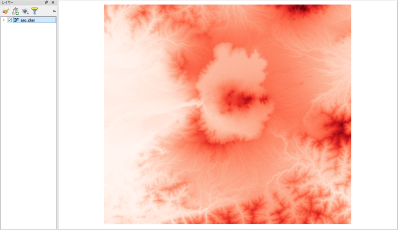
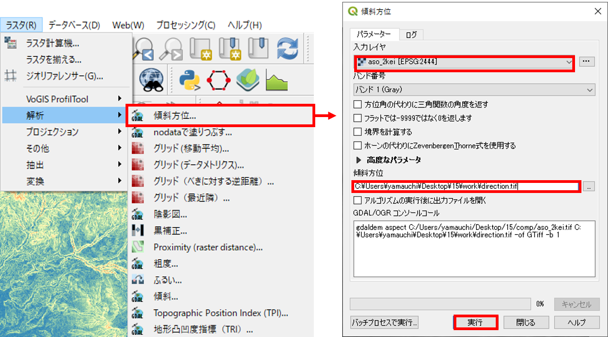
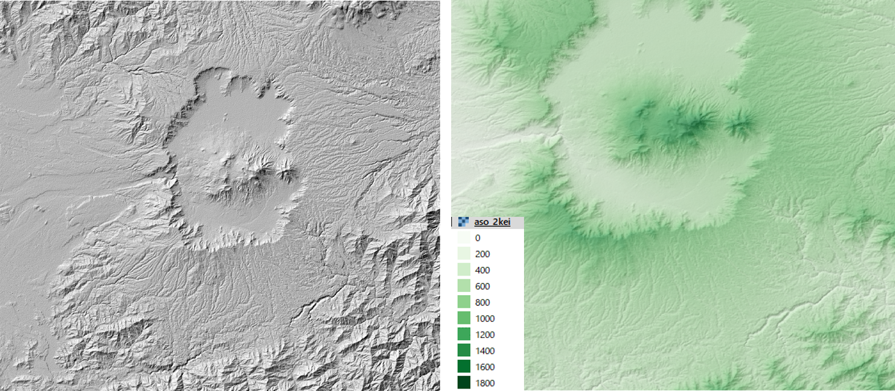
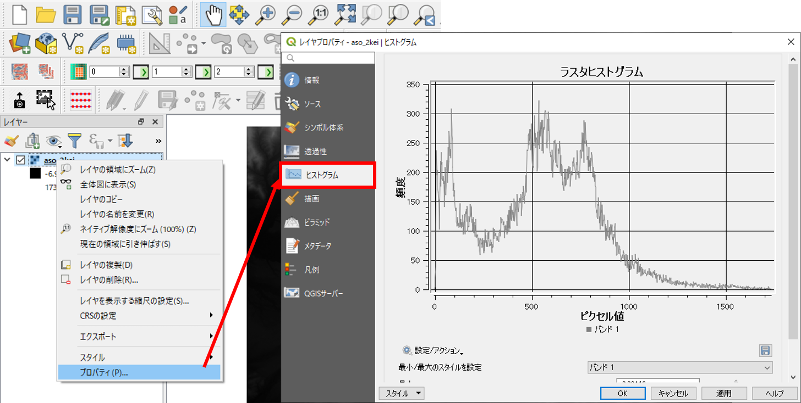

# 2019年度　環境学実習（第5回　GIS実習）

## 本日の実習内容
1. [GISの基本概念](#1_GISの基本概念)
2. [GISソフトウェアの操作法_データの特徴_地図のレイアウト](#2_GISソフトウェアの操作法_データの特徴_地図のレイアウト)
3. [地形情報の可視化、算出](#3_地形情報の可視化_算出)
4. [課題、アンケート](#4_課題_アンケート)

# 1_GISの基本概念
[講義用教材へ移動する](https://gis-oer.github.io/gitbook/book/materials/00/00.html)

# 2_GISソフトウェアの操作法_データの特徴_地図のレイアウト
本教材は、QGIS入門者向けの実習用教材です。QGISを実際に操作しながら、空間データの表示、シンボルの変更、地図のレイアウト等を学習することができます。

**実習用データ**

実習をはじめる前に、[tokyo.zip]をダウンロードしてください。

[tokyo.zip]:https://github.com/gis-oer/datasets/raw/master/tokyo.zip

### 実習の注意事項
- QGISはインストールされているものを利用してください。
- ファイル名、出力先などに日本語が含まれているとエラーが起きる場合があります。
- デフォルトの設定（ディレクトリ）でデータを出力するとエラーが起きます。
- shapeファイルは、.shp,.shx,.dbf等の複数のファイルから構成されます。そのため、移動する際にはすべてを移動してください。.shpのみを移動したために、データが表示できないというミスが多いです。
- 空間座標系の関係上、各教材や課題の終了後にQGISを一度閉じ（作業ファイルは任意の場所に保存）、再起動してから次の実習、課題を行ってください。

## QGISとは？
　QGISは、無償で利用できるオープンソース（GNU General Public License v2で提供）のGISです。Windows,Mac,Linux,Unix, Androidなど様々な環境で動作します。様々なプラグインや、GRASSやPostGISなど他のオープンソースGISと連携して使用することで、多種類の分析が可能です。GISの基本操作に必要な機能を網羅しているだけでなく、Web上に多数のマニュアルがアップロードされているため、GISの学習がしやすいソフトウェアです。  

> http://qgis.org/ja/site/about/index.html を参考に作成

## 起動
　デスクトップのQGISアイコンをダブルクリックする。しばらくするとQGISが起動する。

## ウインドウ
　QGISを起動すると、下の図のようなウィンドウが表示されます。ウインドウ上のアイコンの配置は自由に変更することができます。アイコンのない箇所（グレーの部分）で右クリックして出てくる「パネル」メニューからパネルを選択することにより、別機能のパネルを呼び出すことができます。アイコンの数は、インストールしているプラグインの数によっても異なります。そのため、インストール直後のQGISと教材の画像が異なっていることを確認してください。

## 各種ボタン
　以下では、QGISで主に使用するボタンについて解説しています。

1. QGISファイルを保存
2. 名前をつけてQGISファイルを保存
3. 地図移動
4. 地図の拡大と縮小
5. 選択領域にズーム
6. 動作の前後移動
7. 地物情報の表示
8. 選択と選択取り消し
9. 長さ、面積計測（手動）
10. レイヤ編集
11. レイヤの読み込み

また、ウィンドウの下部にはカーソルの座標や縮尺、拡大、回転、座標系などを確認できるツールバーがあります。

## データの読み込み
　GISでは、位置情報を保持するベクトルデータとラスタデータを用いて、空間分析等を行います。各データの特徴は、[GISの基本概念_ベクトルデータとラスタデータ](../00/00.md)を参照してください。以下では、代表的なデータ形式を取り上げ、それらをQGISで読み込む手法について解説します。教材中に記載されている使用データ([tokyo.zip])を用意してください。そして、tokyo.zipファイルをダウンロード後に解凍してください）。

### ベクトルデータ読み込み
以下では、GISで扱う代表的なベクトルデータ形式のシェープファイルを読み込む手法について解説する。シェープファイルの特徴は、[GISの基本概念_シェープファイル](../00/00.md)を参照してください。

`データソースマネージャーを開く`のアイコンをクリックし、`ベクタ`のタブに切り替える。エンコーディングをUTF-8とし、ソースから、cvs_jgd2011_9.shpを指定する。`追加`をクリックするとデータが表示される。

上記のように、cvs_jgd2011_9.shpを読み込むと、東京23区内のコンビニが表示される（ポイントデータ）。ベクトルデータには、ポイント、ライン、ポリゴンのデータ形式がある。ラインとポリゴンも同様の手法で読み込むことができる。

#### ライン
東京周辺の河川(river_9kei.shp)を表示する。

#### ポリゴン
東京23区のエリア(tokyo_23ku_jgd2011_9.shp)を表示する。

【註】ここまで続けてベクトルデータを読み込むと、ポイントの上にラインが被さり、さらにポリゴンのデータが被さって表示されます。これはレイヤーで後から読み込んだものが、一番上に表示されるためです。3つのデータがうまく表示されるように、レイヤーパネルでレイヤー名をドラッグしてレイヤー順番を変えます。委細については、後の「レイヤ構造」で説明します。

### ラスタデータの読み込み
以下では、GISで扱う代表的なラスタデータ形式のGeotiffを読み込む手法について解説する。`データソースマネージャーを開く`のアイコンをクリックし、`ラスタ`のタブに切り替える。ソースから、tokyo_srtm.tifを指定し追加をクリックする。

#### テキストデータ読み込み
以下では、GISで扱う代表的なテキストファイルであるCSV形式のデータを読み込む手法について解説する。`データソースマネージャーを開く`のアイコンをクリックし、`デリミティッドテキスト`のタブに切り替える。ファイル名から、post_office.csvを指定する。X,Yフィールドに対応する緯度経度があれば指定し、緯度経度がなければジオメトリなしにチェックをする(ここでは、`ジオメトリ定義＞ジオメトリなし`にチェックを入れてください。)。

【註】本実習のCSVファイルはUTF-8エンコーディングで作成されています。GGIS3のデフォルトでのエンコーディング（レイヤ名の横で指定できます）はUTF-8になっていますのでこのままで結構です。ただ、Windowsで作成されるCSVファイルはShift-JIS形式で作成されていることが多いので、その場合はエンコーディング形式を「Shift-JIS」に選択する必要があります。エンコーディングが正しく設定されているかは、サンプルデータの表示が適切になされていることで確認することができます。

## レイヤ構造
　GISでは、レイヤ構造に従ってデータの切り替えや重ね合わせを行います。以下では、レイヤの切り替え、重ね合わせ、削除の手法を解説します。

### レイヤ表示の切替
各レイヤの横にあるチェックボックスにチェックをいれると、地図表示画面にレイヤが表示される。

### レイヤの重ね合わせ
レイヤウィンドウでレイヤを上下にずらすと、地図表示画面が連動して切り替わる。

### レイヤの削除
レイヤウィンドウでレイヤの上で右クリックし、`レイヤの削除`をクリックする。この処理では、レイヤウィンドウ上からレイヤが消えるのみで、データそのものは削除されていない点に注意する。

## 機能説明
　QGISには、地図のレイアウト、データの作成、分析など様々な機能がありますが、詳しくは、集中講義のGIS実習で紹介します。

## 属性テーブル
　ベクトルデータは、複数の属性情報を保持することができます。以下では、QGISで属性情報を参照する手法について、解説しています。

**以下では、cvs_jgd2011_9.shpのみ利用します。不要なレイヤを削除してください。**

データを読み込み、レイヤウィンドウのレイヤの上で右クリックすると、属性テーブルを開くことができる。

属性テーブルで選択したものは、地図上で黄色で表示される。選択アイコンで地図上の地物を選択した場合は、その地物に対応する属性テーブルの行が選択される。
地図上の地物を選択した時に、そのままでは属性テーブルの中で全てのデータが表示され、選択したものがわかりにくい時がある。その時には属性テーブルの下部にあるポップアップメニューから「選択した地物を表示する」を選択し、選択された地物に関する属性だけが表示されるようにすることで見やすくなります。
なお、ポリゴンによる選択（選択ボタンの右側にある小さな三角を押すとポップアップメニューが表示され、ポリゴン、フリーハンド等が選択できます）は、右クリックで終了し、フリーハンドによる選択は左クリックで終了と、操作性に一貫がなく分かりにくい状態です。

## プロパティ
　QGISでは、レイヤごとにレイヤのプロパティから、データの表示情報やスタイルの変更ができます。ポイントでは形や大きさ、ラインでは線の形や太さ、ポリゴンでは塗りつぶしの色等を変更することができます。属性情報に応じて、スタイルを分けることもできます。これは、レイヤの表示が変化するのみの処理で、データそのものの形状は変更されません。

以下では、レイヤのプロパティについて解説し、ポイントデータのスタイルの変更を行います。

レイヤウインドウからプロパティを表示したいレイヤを選択し、右クリックからプロパティをクリックする。

### ソース
座標系を確認したり、文字コード、表示名の変更がきます。

### シンボロジー
データのスタイルを整えることができる機能です。データの値に応じて配色やスタイルを変えることができます。分類方法は「単一シンボル」、「分類された」、「段階に分けられた」等があります。

ここでは、ポイントデータの大きさと色を変更します。`単一シンボル`を選択し、色と大きさを指定する。指定できた状態で`OK`をクリックすると変更が適用される。**今回は単色のシンボルので実習を進めてください**

以下のように、形を変更することもできる。

## 地図タイルの読み込み
　以下では、QGISにXYZタイル形式の背景地図（地理院タイル等）を読み込む手法について解説します。事前にタイル情報を記述したxmlファイルを用いて、`接続をロード`から、複数のタイルをを一括で読み込むことが可能です。ここでは、使用データのファイル内にある`gisoer_tiles.xml`を利用します。

> gisoer_tilesは、株式会社MIERUNEの[GitHub(MIERUNE/mierune-qgis)](https://github.com/MIERUNE/mierune-qgis)を参考に作成したものです。

## 地図のレイアウト
　以下では、スタイリングしたデータと地理院タイルを用いて、地図をレイアウトして画像として出力する手法について解説します。この実習をはじめる前に、地図画面を任意の地域に拡大してください（以下では、東京大学本郷キャンパス周辺を表示しています）。

`プロジェクト＞新規プリントレイアウト`を選択し、タイトル（地図名など任意）を入力する。データが重ならない場合は、オンザフライCRS投影がうまくいっていない可能性があるので、QGISを再起動する。その後、サンプルデータ、XYZタイルの順で読み込む。

### プリントコンポーザ
プリントレイアウトでは、以下の機能を利用して地図を作成することができる。

1. アイテムの選択と移動
2. 地図の移動
3. 地図の追加
4. 画像の追加
5. テキストの追加
6. 凡例の追加
7. 縮尺バーの追加
8. 地図の出力

※アイテムの削除は編集から行う。

#### レイアウト
以下のような地図を作成するため、地図、縮尺バー、凡例、タイトル等を追加する。

#### 地図の追加
地図の追加ボタンをクリックし、地図のレイアウト画面上でドラッグして大きさを指定して、地図を追加する。※追加される地図は、QGISで表示している範囲となる。

#### 縮尺バーの追加
　以下のように、矢印の位置をクリックし、縮尺バーを追加する（ドラッグでの追加も可能）。縮尺バーを選択した状態で、アイテムプロパティのタブに切り替え、線分列の大きさの値等を変更する。

#### 凡例の追加
縮尺と同様に凡例を追加する。凡例を選択し、アイテムプロパティで調整する。自動アップデートのチェックをはずすと凡例が編集できる。名称の変更、凡例項目の追加と削除ができる。**今回は単一のシンボルで実習を進めているので、レイヤ名を東京23区内のコンビニと表記する**

#### 方位記号の追加
画像の追加から方位記号を追加する。`アイテムプロパティ＞検索ディレクトリ`をクリックし、方位記号を選択する。デフォルトの状態では、図の赤枠部分をクリックしないと検索ディレクトリが開かないため、注意する。以下のように、アイテムプロパティで、画像の調節を行う。

#### テキストの追加
テキストの追加からテキストを追加する。メインプロパティに入力したいテキストを記述する。

以下のように、フォントのサイズや配置等を調節する。

同様の手法で、任意の個所に、背景地図やデータのライセンス等必要な情報をテキストで追加する。

### 画像の出力
地図のレイアウトを整えた後、画像としてエクスポートする。`レイアウト＞画像としてエクスポート`を選択する。

エクスポートした画像ファイルをダブルクリックすると、以下のような地図が表示できる。画像を出力した後、プリントレイアウトを閉じる。**今回は単一、単色のシンボルのでOK**

## 作業ファイルの保存
QGISには、作業ファイルを保存する機能がある。これにより、一度QGISを閉じた後でも、前回の状態から作業を再開することができる。

`プロジェクト＞名前を付けて保存`をクリックし、任意の名称で出力する。次回開くときは、出力した.qgzファイルをダブルクリックするとQGISが立ち上がる。

【註】Macではインストール後に.qgzファイルとQGIS3の関連付けがなされていませんので、クリックしたときにアプリケーションの選択を聞かれますので、そこでQGIS3を「開くアプリケーション」として指定してください。

# 3_地形情報の可視化_算出
　本教材は、「ラスタデータの分析」の実習用教材です。各セルに標高値を保持しているラスタデータを用いて、地形解析の手法について解説しています。本教材では、数値標高モデル(DEM)として整備されたデータを用います。DEMは、Digital Elevation Modelの略であり、地形解析等に用いられるデータです。

**実習用データ**

実習をはじめる前に、[aso]をダウンロードしてください。

[aso]:https://github.com/gis-oer/datasets/raw/master/aso.zip

----------

## 数値標高モデルの視覚的分析
各セルごとに標高値を保持しているラスタデータを用いることで、傾斜区分図、斜面方位図、陰影図、3D地図、断面図を作成することができます。以下では、その手法について解説しています。QGISを起動し、`データソースマネージャ>ラスタ`からラスタデータを表示してください。

### 標高段彩図の作成
`プロパティ＞シンボル体系`を選択し、レンダリングタイプを`単バンド疑似カラー`を選択し`OK`をクリック押すとラスターの配色が変更できる。

下の図のように、ラスターの配色が変更された。

シンボル体系では、最小、最大値、分類モード、分類数等を指定できる。各項目を設定後、分類をクリックすると反映される。また、各値、ラベルの上で、ダブルクリックすると値、ラベルの指定ができる。

以下では、200ｍ間隔で標高値を色分けした。

### 傾斜区分図の作成
`ラスタ＞解析＞傾斜`を選択し、`実行`をクリックすると傾斜区分が計算できる。

下の図のように、傾斜区分図が表示された。

### 斜面方位図の作成
`ラスタ＞地形解析＞傾斜方位`を実行すると傾斜方位が計算できる。

下の図のように、斜面方位図が表示された。
斜面は、360°で計算されるため角度に応じて値を分類する。

### 陰影図の作成
`ラスタ＞地形解析＞陰影図`を実行すると陰影図が計算できる。

下の図のように、陰影図が表示された。
右下の図のように陰影図を元にしたラスタを重ねて、透過率を設定することで立体的な地形表現ができ地形の高低差が読み取りやすくなる。

※透過率は、`プロパティ＞透過性`から設定する。

### 鳥瞰図の作成
`ビュー＞新しい3Dマップビュー`を選択し、`3Dビューの設定`アイコンをクリックする。

高さに標高値のラスタデータを指定し、ＯＫをクリックする。ウィンドウ内で地図を動かすと3次元表示されていることが確認できる。鉛直スケールを1以上とすると、下の図のように地形を誇張して表現できる。

### 地形断面図の作成
`プラグイン＞プラグインの管理とインストール`から`VoGIS Profile tool` をインストールする。

`ラスタ>VoGIS ProfileTool > VoGIS Profile Tool`から起動する。

1. 断面図を作成するラスタにチェックを入れる。
2. `Digitize (new) profile line` をクリックする。
3. QGISの地図上でクリックしながらラインを作成する。（右クリックで終了）
4. `Create Profile`をクリックすると別ウィンドウに断面形状が表示される。

## 基本的な統計量の確認
以下では、QGISでラスタデータが保持する情報を確認する手法を解説しています。

`ラスタ＞その他＞ラスター情報`を開き、統計情報を表示するラスタを選択し、`画像統計量を読み込んで表示する`にチェックをつけ、実行をクリックする。

実行結果は、結果ビューアの`File path`をクリックし、html形式で確認する（座標系、セルサイズ、最低標高、最高標高、平均標高、標高の標準偏差等）。

ヒストグラムの表示は、`プロパティ＞ヒストグラム`を選択し、`ヒストグラムの計算`をクリックする。ヒストグラムを左クリックすると拡大でき、右クリックで元のビューに戻る。

※外れ値は、`プロパティ＞シンボロジー`の`最小/最大値設定`から、`累積数カット`等を指定し`適用`をクリックすることで、地図表現上、除外できる。

## ラスタ演算
　GISでは、ラスタデータのセルの大きさや領域が同一であれば、演算によって新規のデータを出力できます。この処理は、地形の変化を計算する際などに用いられます。例えば、10年前に取得された標高データと現在取得したデータを引き算することで地形の変化量を求めることができます。以下では、標高データや傾斜データを用いて、条件指定したエリアを抽出する手法について解説します。

はじめに、標高値と傾斜角のラスタを読み込む。`ラスタ＞ラスタ計算機`から計算結果を出力するための新規ラスタを作成する。

DEMから標高450ｍ以上の地域を抽出する。
ラスタ計算式に`“aso_2kei@1” >= 450`を入力後、OKをクリックすると右下の図のように表示される。

DEMから標高300m以上で傾斜が5度以下の地域を抽出する。
ラスタ計算式に`“aso_2kei@1” >= 450 AND “slope@1” <= 5`を入力後、`OK`をクリックすると右下の図のように表示される。
※"slope@"1は[斜面方位図の作成]で作成した傾斜ラスタである。

# 4_課題_アンケート
以下の課題は、それぞれQGISを再起動した後、行ってください。

### 課題A
当日配布する巡検地点のデータ（points.shp）を用いて、タイトル、縮尺、方位記号、凡例、背景地図（空中写真・衛星画像）をまとめた巡検ルートの概観図を作成してください。

### 課題B
当日配布する2年分の木戸浜のデータを用いて、木戸浜の標高段彩図（透過性をつけ陰影図を重ねたもの）と、傾斜区分図を作成してください（凡例、タイトル、方位、縮尺は必須）。2016と2017年のデータは、目視で比較できるように同一の基準で配色してください。

### 課題C
フィールド計算機を用いて、木戸浜の2016年と2017年のデータ（=2016.tif-2017.tif）を実行し、地形の変化量を可視化してください。可視化時の最小値、最大値の設定は、値のバランスを見ながら行うこと。また、堆積は赤系統、浸食は青系統の色、変化量の小さい箇所は黄色系統の色で可視化してください。*少し応用的な処理なので必要があれば、当日解説します。*

### アンケートのお願い
本教材はGIS教育の研究の一環で整備していますので、[アンケート]の回答もお願い致します。
