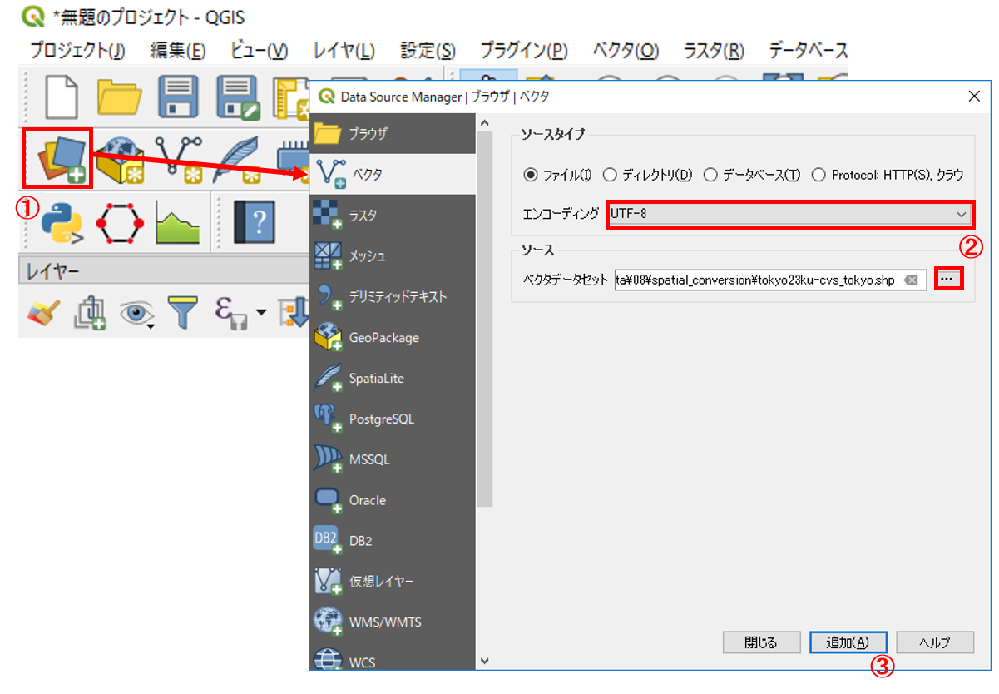
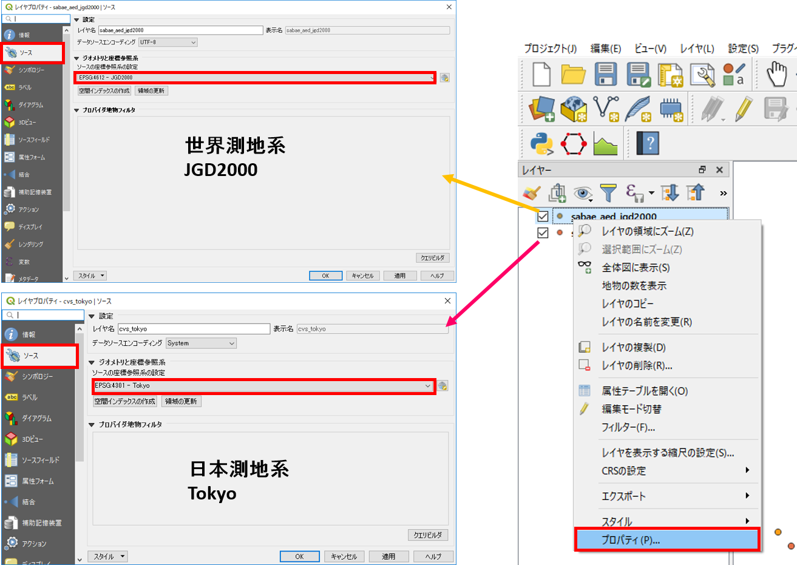
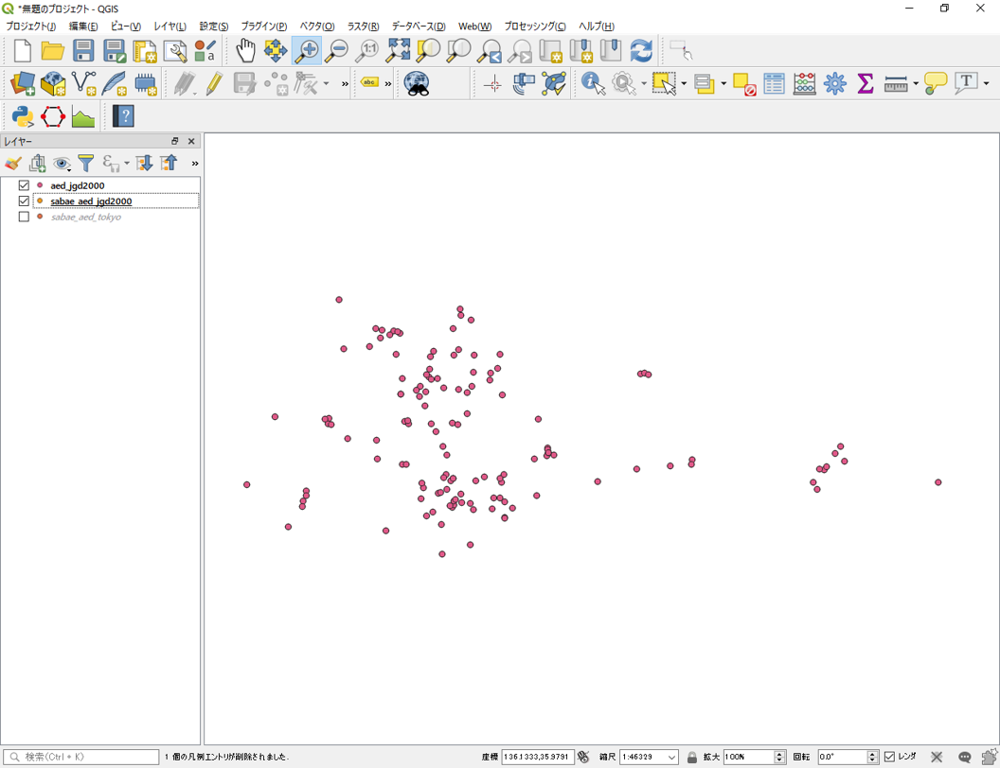

# 空間データ
　本教材は、「空間データ」の実習用教材です。GISソフトウェア（QGIS）を用いて、空間座標の変換、ジオリファレンス、ジオコーディングについて解説しています。講義用教材として、[地理情報科学教育用スライド（GIScスライド）]の3章が参考になります。

**Menu**
-------
- [空間座標の変換](#空間座標の変換)

以下は解説を省略したため、関心のある方は、GIS実習オープン教材を参照してください。
- [ジオリファレンス](#ジオリファレンス)
- [ジオコーディング](#ジオコーディング)

**実習用データ**

実習をはじめる前に、[Sabae]をダウンロードしてください。

[Sabae]:https://github.com/gis-oer/datasets/raw/master/sabae.zip

## 空間座標の変換
　地理空間情報（GISで扱うことのできるデータ）は、測地系と座標系に基づいた位置情報を保持しています。測地系や座標系は様々なものがあります。そのため、複数のデータを処理する場合は、各データの座標系を統一する必要があります。その際に、空間座標の変換を行います。以下では、QGISを用いた変換手法を解説しています。空間座標系についての解説は、[地理情報科学教育用スライド（GIScスライド）]の3章や[GISの基本概念]の教材を参照してください。また、この実習を始める前に、以下の座標変換の正誤事例を参照し、今後の作業で誤った座標変換を行わないように注意してください。

<iframe width="560" height="315" src="https://www.youtube.com/embed/jAHJNI5CiKw" frameborder="0" allow="accelerometer; autoplay; encrypted-media; gyroscope; picture-in-picture" allowfullscreen></iframe>

**※以下の教材で使用しているQGIS3.4では、JGD2011の変換のエラーがあるため、JGD2011のデータに対してJGD2000を割り当てている点に注意してください。**

### 測地系変換
[Sabae]をダウンロードし、以下の手順に従って、sabae_aed_tokyo（日本測地系 緯度経度）とsabae_aed_jgd2000（世界測地系　緯度経度）のシェープファイルをQGISに読み込む。

1. データソースマネージャを開く。
2. エンコーディングをUTF-8に設定し、ソースから、ダウンロードした日本測地系と世界測地系のshape（sabae_aed_jgd2000とsabae_aed_tokyo）を指定する。
3. 「追加」 をクリックする。

この際に、QGISが自動で、擬似的な位置あわせをしてしまうため、オンザフライ投影の機能をオフにする。

1. 右下のEPSGのボタンをクリックする。
2. 投影なしにチェックをつけ、オンザフライ投影を無効にする。

以下のように、データは同じ場所のものにもかかわらず、座標系が異なるためずれて表示されることを確認する。

それぞれのレイヤの上で右クリックして、プロパティ（ソースのタブ）から座標系を確認する。

以下の手順で、日本測地系を世界測地系へ変換する。

1. プロパティ＞エクスポート＞地物の保存をクリックする 。

2. 新規レイヤの出力先と名前を選択する。
3. CRSを選択するために、図中の③をクリックし、フィルターからJGD2000を検索し、OKをクリックする。
4. OKをクリックする。

以下のように、測地系がJGD2000に変換された。

### 投影変換
以下では、地理座標系のデータを投影座標系の平面直角座標系へ変換する手法について解説する。世界測地系緯度経度のデータを用いて、以下の処理を行う。

1. プロパティ＞エクスポート＞地物の保存をクリックする。
2. 新規レイヤの出力先と名前を選択する。
3. CRSのボタンをクリックし、変更したいCRSを選択（JGD2000 / Japan Plane Rectangular CS Ⅵ）してOKをクリックする。
4. OKをクリックする。

以下のように、座標系が（JGD2000 / Japan Plane Rectangular CS Ⅵ）に変換された。座標系が変換したため、レイヤが重なって表示されないことを確認する。

※世界測地系の平面直角座標系へ変換する場合に、地域によって○○系と指定する必要がある。詳しくは、国土地理院の[平面直角座標系の対応表]を参考にする。

**※空間座標の変換のよくある間違いとして、新規にデータを作成せず、プロパティ（一般情報）の空間参照システムからCRSを選択する等があるため、今後同様の処理を実行するときに注意する。**

[▲メニューへもどる]

#### この教材の[課題ページ_空間データ]へ進む

#### ライセンスに関する注意事項
本教材で利用しているキャプチャ画像の出典やクレジットについては、[その他のライセンスについて]よりご確認ください。

[▲メニューへもどる]:./08.md#Menu
[地理院タイル]:http://maps.gsi.go.jp/development/ichiran.html
[Google Maps Geocoding API]:https://developers.google.com/maps/documentation/geocoding/intro?hl=ja
[KTGIS.net]:http://ktgis.net/gcode/geocoding.html
[データシティ鯖江ポータルサイト]:http://data.city.sabae.lg.jp/
[CSVアドレスマッチングサービス]:http://newspat.csis.u-tokyo.ac.jp/geocode-cgi/geocode.cgi?action=start
[susono_emergency_shelter.csv]:https://github.com/gis-oer/datasets/raw/master/vector/susono_sample.zip
[平面直角座標系の対象表]:http://www.gsi.go.jp/LAW/heimencho.html
[地理情報科学教育用スライド（GIScスライド）]:http://curricula.csis.u-tokyo.ac.jp/slide/3.html
[利用規約]:../../policy.md
[その他のライセンスについて]:../license.md
[よくある質問とエラー]:../questions/questions.md

[GISの基本概念]:../00/00.md
[QGISビギナーズマニュアル]:../QGIS/QGIS.md
[GRASSビギナーズマニュアル]:../GRASS/GRASS.md
[リモートセンシングとその解析]:../06/06.md
[既存データの地図データと属性データ]:../07/07.md
[空間データ]:../08/08.md
[空間データベース]:../09/09.md
[空間データの統合・修正]:../10/10.md
[基本的な空間解析]:../11/11.md
[ネットワーク分析]:../12/12.md
[領域分析]:../13/13.md
[点データの分析]:../14/14.md
[ラスタデータの分析]:../15/15.md
[傾向面分析]:../16/16.md
[空間的自己相関]:../17/17.md
[空間補間]:../18/18.md
[空間相関分析]:../19/19.md
[空間分析におけるスケール]:../20/20.md
[視覚的伝達]:../21/21.md
[参加型GISと社会貢献]:../26/26.md

[地理院地図]:https://maps.gsi.go.jp
[e-Stat]:https://www.e-stat.go.jp/
[国土数値情報]:http://nlftp.mlit.go.jp/ksj/
[基盤地図情報]:http://www.gsi.go.jp/kiban/
[地理院タイル]:http://maps.gsi.go.jp/development/ichiran.html

[スライド_GISの基本概念]:https://github.com/gis-oer/gis-oer/raw/master/materials/00/00.pptx
[スライド_QGISビギナーズマニュアル]:https://github.com/gis-oer/gis-oer/raw/master/materials/QGIS/QGIS.pptx
[スライド_GRASSビギナーズマニュアル]:https://github.com/gis-oer/gis-oer/raw/master/materials/GRASS/GRASS.pptx
[スライド_リモートセンシングとその解析]:https://github.com/gis-oer/gis-oer/raw/master/materials/06/06.pptx
[スライド_既存データの地図データと属性データ]:https://github.com/gis-oer/gis-oer/raw/master/materials/07/07.pptx
[スライド_空間データ]:https://github.com/gis-oer/gis-oer/raw/master/materials/08/08.pptx
[スライド_空間データベース]:https://github.com/gis-oer/gis-oer/raw/master/materials/09/09.pptx
[スライド_空間データの統合・修正]:https://github.com/gis-oer/gis-oer/raw/master/materials/10/10.pptx
[スライド_基本的な空間解析]:https://github.com/gis-oer/gis-oer/raw/master/materials/11/11.pptx
[スライド_ネットワーク分析]:https://github.com/gis-oer/gis-oer/raw/master/materials/12/12.pptx
[スライド_領域分析]:https://github.com/gis-oer/gis-oer/raw/master/materials/13/13.pptx
[スライド_点データの分析]:https://github.com/gis-oer/gis-oer/raw/master/materials/14/14.pptx
[スライド_ラスタデータの分析]:https://github.com/gis-oer/gis-oer/raw/master/materials/15/15.pptx
[スライド_空間補間]:https://github.com/gis-oer/gis-oer/raw/master/materials/18/18.pptx
[スライド_視覚的伝達]:https://github.com/gis-oer/gis-oer/raw/master/materials/21/21.pptx
[スライド_参加型GISと社会貢献]:https://github.com/gis-oer/gis-oer/raw/master/materials/26/26.pptx

[課題ページ_QGISビギナーズマニュアル]:./tasks/t_qgis_entry.md
[課題ページ_GRASSビギナーズマニュアル]:./tasks/t_grass_entry.md
[課題ページ_リモートセンシングとその解析]:./tasks/t_06.md
[課題ページ_既存データの地図データと属性データ]:./tasks/t_07.md
[課題ページ_空間データ]:./tasks/t_08.md
[課題ページ_空間データベース]:./tasks/t_09.md
[課題ページ_空間データの統合・修正]:./tasks/t_10.md
[課題ページ_基本的な空間解析]:./tasks/t_11.md
[課題ページ_ネットワーク分析]:./tasks/t_12.md
[課題ページ_基本的な空間解析]:./tasks/t_13.md
[課題ページ_点データの分析]:./tasks/t_14.md
[課題ページ_ラスタデータの分析]:./tasks/t_15.md
[課題ページ_空間補間]:./tasks/t_18.md
[課題ページ_視覚的伝達]:./tasks/t_21.md
[課題ページ_参加型GISと社会貢献]:./tasks/t_26.md
